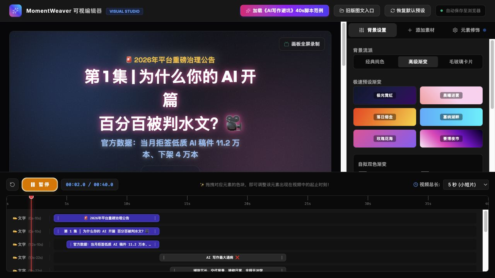

# MomentWeaver - 圈影

[English](README_EN.md) | 中文

把朋友圈图片和文案转换成可发布到微视的 9:16 短视频。

## 产品展示

MomentWeaver 提供可视化画布、素材与背景编辑、可拖拽时间轴，以及后端 MP4 渲染入口。下图为加载内置示例脚本后的实际界面：



从内容草稿到交付文件的核心流程：

```text
图片 / 文案 → 分镜与时间轴 → 画布预览 → BGM / 配音 → 后端渲染 1080×1920 MP4
```

## What It Does

- 上传朋友圈配图或截图，粘贴原始文案。
- 通过项目内置 `lib/nebula_llm_sdk` 发布包生成微视短视频分镜、标题、字幕和发布文案。
- 可选调用项目内置 `lib/smart-asset-kit` 发布包生成背景音乐；同一套 SAK 音频配置也可供课程旁白/TTS 管线复用。
- 使用本机 `ffmpeg` 渲染 1080x1920 MP4，适合转发或上传到微视。
- 查看本地导出记录，选中视频后准备视频号/微视短标题、视频描述、发布文案、4:3 横屏封面和文件路径。
- 接收 `video-background-board` 的可视舞台/时间轴项目，通过后端统一生成 MP4 并写入发布准备状态。

项目名：

- 中文名：圈影
- 工程名：MomentWeaver
- 含义：把朋友圈的“圈”织成可传播的短视频影像。

## 发布素材交付约定

MomentWeaver 的完成标准不是只生成一个 MP4。凡是用于公开发布、宣发或交付的短视频任务，必须同时准备以下素材：

1. 竖版成片：1080×1920、H.264/AAC MP4。
2. **4:3 横屏封面（必需）**：用于内容列表、文章头图、横屏推荐位或发布预览。
3. 发布短标题：先说明产品或内容是什么，再加入最强钩子。
4. 发布描述：包括开场问题、核心卖点、可信证据和行动邀请。
5. 话题标签：控制数量，优先保留产品名、品类与核心主题。
6. 有旁白时：保留逐段旁白稿、音色、真实音频时长与同步信息。

推荐交付结构：

```text
publish-assets/
  final-video.mp4
  cover-4x3.jpg
  cover-4x3.png
  PUBLISH_COPY.md
  narration.md          # 有旁白时
```

### 4:3 横屏封面规范

| 项目 | 要求 |
| --- | --- |
| 比例 | 固定为 4:3，不以 16:9 视频截图代替 |
| 推荐尺寸 | 1600×1200；最低 1200×900 |
| 格式 | 发布用 JPEG；同时保留无损 PNG 版本 |
| 色彩 | sRGB，避免平台转换后明显偏色 |
| 安全区 | 关键标题、产品名和状态标识距离四边至少 5% |
| 标题层级 | 产品名最大；一句核心钩子次之；版本或“公开试玩”等状态作为印章/角标 |
| 缩略图检查 | 缩小到约 320×240 后，仍能一眼读出产品名和核心卖点 |
| 视觉一致性 | 优先复用成片主视觉、品牌字体、色板与角色/场景资产 |
| 内容真实性 | 不写未实现功能，不把 Demo 包装成正式商业发行，不使用无法核验的数据 |
| 文件命名 | `<project>-cover-4x3.jpg` 与 `<project>-cover-4x3.png` |

封面需要单独构图：横屏封面应重新安排视觉重心与文字层级，不能简单拉伸竖版画面，也不能直接截取带字幕的视频帧。建议至少包含：

- 清晰的产品或内容名称；
- 一个能让目标用户立即理解品类的短钩子；
- 必要的版本、章节、公开试玩或发布时间状态；
- 与成片一致的主视觉，但为 4:3 阅读重新裁切；
- 背景复杂时使用渐变、纸张、描边或阴影保证文字可读性。

交付前检查：

- [ ] MP4 能正常播放，音轨可听且旁白清晰。
- [ ] 4:3 封面同时提供 JPEG 和 PNG。
- [ ] 封面尺寸、比例、安全区与缩略图可读性合格。
- [ ] 短标题包含产品名或内容主体，不只描述制作过程。
- [ ] 发布描述先卖体验，再补充制作方式和质控证据。
- [ ] 所有最终文件路径已写入发布交接说明。

当前 Visual Project Render API 的稳定产物仍以 MP4 和 `publish.json` 为主；在自动封面生成进入后端前，调用方或下游发布流程必须补齐 4:3 封面，不能把“只有视频、没有封面”的任务标记为完成。

## Quick Start

```bash
cd MomentWeaver
python3 -m pip install -r requirements.txt
cp .env.example .env
./start.sh
```

To serve the merged visual editor from the MomentWeaver backend, build the React frontend first:

```bash
cd ../video-background-board
npm install
npm run build
cd ../MomentWeaver
./start.sh
```

If `video-background-board/dist` does not exist yet, MomentWeaver falls back to its legacy static frontend.

The merged editor is the default homepage when the build exists. The legacy MomentWeaver image/caption workflow remains available at:

```text
http://127.0.0.1:8787/legacy
```

Then open:

```text
http://127.0.0.1:8787
```

You can edit `.env` from the in-app settings panel. Host, port, reload, and Python runtime changes take effect after restarting `./start.sh`; Nebula and Smart Asset Kit settings are applied immediately for new requests.

The app works without an LLM key by using a local storyboard fallback. To enable the model planner, set these in `.env`:

```bash
NEBULA_API_KEY=...
NEBULA_PROVIDER=openai
NEBULA_MODEL=gpt-4o-mini
NEBULA_BASE_URL=
NEBULA_SDK_PATH=lib/nebula_llm_sdk
```

By default, MomentWeaver uses the installed SDK package under `MomentWeaver/lib/nebula_llm_sdk`, not a source checkout. Relative SDK paths in `.env` are resolved from the `MomentWeaver/` project root.

## Visual Project Render API

MomentWeaver also accepts visual editing output from `video-background-board`.

```text
POST /api/visual-projects/render
GET  /api/visual-projects/{job_id}/status
```

The render request body is:

```json
{
  "project": {
    "title": "可视编辑短视频",
    "description": "发布描述",
    "weishi_caption": "微视文案",
    "hashtags": ["可视编辑", "MomentWeaver"],
    "timelineDuration": 15,
    "canvas": { "width": 1920, "height": 1080, "aspect_ratio": "16:9" },
    "background": {},
    "elements": [],
    "source": "video-background-board"
  }
}
```

The backend writes:

- `storage/jobs/{job_id}/visual_project.json`
- `storage/jobs/{job_id}/render_status.json`
- `storage/jobs/{job_id}/plan.json`
- `storage/jobs/{job_id}/videos/{job_id}_visual.mp4`
- `storage/jobs/{job_id}/publish.json`

This path keeps browser recording as an optional front-end tool; the final deliverable MP4 comes from MomentWeaver's backend renderer.

## Smart Asset Kit

The default SAK path points to the installed SDK package in this project:

```text
MomentWeaver/lib/smart-asset-kit
```

Override it if needed:

```bash
SMART_ASSET_KIT_PATH=/path/to/smart-asset-kit
```

Local SAK credentials remain in `$SMART_ASSET_KIT_PATH/.sak_config.json`; that file is ignored and is not copied from any external SDK checkout.

The current SAK CLI supports `sak gen-audio`. MomentWeaver uses it directly for BGM, and companion course/video pipelines can reuse the same SAK MiniMax audio configuration for formal voiceover or TTS.

Built-in BGM flow:

1. Generate storyboard.
2. MomentWeaver automatically creates a BGM prompt and searches candidates.
3. Click download on a candidate.
4. After the mp3 is downloaded/generated successfully, MomentWeaver automatically renders the MP4 with that music.

Voiceover/TTS reuse:

- MomentWeaver itself does not currently expose a narrator-recording UI.
- For course pipelines such as `AICodingCLI`, set `SMART_ASSET_KIT_PATH` to this SAK directory and use the pipeline's SAK MiniMax TTS provider, for example `COURSE_TTS_PROVIDER=sak-minimax`.
- The MiniMax key/model live in `smart-asset-kit/.sak_config.json` (`minimax_api_key`, `minimax_audio_model`). This path does not require a separate `MINIMAX_GROUP_ID`.
- Generated manifests should make the backend explicit, for example `provider=minimax` and `tts_backend=sak-minimax`, so it is clear the narration came through SAK rather than the system voice.
- Narration must not fall back to macOS `say` or any local system voice. Missing MiniMax/SAK credentials should fail the job instead of producing release audio.
- Voice selection should stay scene-aware. `Yujie`, `Tianmei`, and `Shaonv` are reliable local MiniMax wrapper presets, but MomentWeaver handoffs may recommend or explicitly pass any available MiniMax `voice_id` when it fits the scene better.

Segmented narration sync:

- For narrated videos, avoid one long voice track over a fixed timeline. Generate narration per scene/segment, measure the real audio duration, then set the visual segment duration to `voice duration + pause`, while still honoring any minimum scene duration.
- Keep `voice_end` separate from the visual segment `end`: the visual scene should hold briefly after speech finishes, leaving natural silence before the next scene.
- MomentWeaver now includes `backend/app/voiceover_sync.py` for this pattern. `build_voiceover_timeline()` creates measured segment timings, and `sync_visual_project_to_voiceover()` can retime a `VisualProject` by matching `VoiceoverSegmentDuration.id` to `VisualAudioSegment.id`.
- This is the preferred path for 3-5 minute explainers, course videos, and any micro-video where subtitles/scene content must stay aligned with narration.

If SAK later adds network music search and download, only `backend/app/music_assets.py` needs to change for MomentWeaver's built-in BGM step.

## Project Layout

```text
MomentWeaver/
  backend/app/       FastAPI API, Nebula planner, SAK adapter, ffmpeg renderer
  frontend/          Static app shell
  lib/               Installed Nebula SDK and Smart Asset Kit packages
  start.sh           Default launcher using system python3
  scripts/dev.sh     Local dev server
  storage/jobs/      Uploaded images and rendered videos
  tests/             Lightweight backend tests
```

## Notes

- The exported MP4 is generated locally; no uploaded assets leave the machine unless you enable LLM or SAK network generation.
- Direct posting to 微视 is intentionally not included in this MVP. The first reliable artifact is a local MP4 ready for manual upload.


---

现在 MomentWeaver 实际用到的 LLM 能力只有两类：

| 能力 | 当前用途 | 配置位置 |
|---|---|---|
| 文本大模型 | 把朋友圈文案转成微视分镜、标题、字幕、发布文案、初始音乐方向 | MomentWeaver `.env` / 设置界面 |
| 音频生成模型 | MomentWeaver 内置用于下载/生成背景音乐；课程/视频管线可复用为旁白 TTS 后端 | `smart-asset-kit` 自己的 `.sak_config.json` |

目前没有用到这些能力：

- 没有用视觉模型理解图片内容，只把图片作为素材和尺寸传入。
- 没有用视频生成模型，MP4 是本地 `ffmpeg` 合成。
- 背景音乐提示词是本地规则从分镜生成的，不额外消耗 LLM。
- MomentWeaver 当前没有内置旁白录制/配音界面；旁白配音由外部课程/视频管线复用 SAK 音频能力完成。

**MomentWeaver 必配**
在设置界面或 `.env` 里配：

```bash
NEBULA_API_KEY=你的 key
NEBULA_PROVIDER=openai
NEBULA_MODEL=gpt-4o-mini
NEBULA_BASE_URL=
NEBULA_SDK_PATH=lib/nebula_llm_sdk
```

推荐先用：

```bash
NEBULA_PROVIDER=openai
NEBULA_MODEL=gpt-4o-mini
```

如果你走 OpenAI 兼容网关，就填：

```bash
NEBULA_BASE_URL=https://your-compatible-endpoint/v1
```

**背景音乐 / 旁白配音必配**
MomentWeaver 内置背景音乐只需要配置 SAK 路径；课程旁白配音也应复用同一个路径：

```bash
SMART_ASSET_KIT_PATH=lib/smart-asset-kit
SAK_PYTHON=python3
```

具体音频模型在 SAK 里配，文件是：

```text
MomentWeaver/lib/smart-asset-kit/.sak_config.json
```

MomentWeaver 当前调用的是 `sak gen-audio` 生成 BGM；课程/视频管线也可以通过 SAK MiniMax 生成旁白。因此只需要配置 SAK 的 `provider`、对应 API key、对应 audio model。比如：

- `provider=minimax`：配 `minimax_api_key`、`minimax_audio_model`
- `provider=gemini`：配 `gemini_api_key`、`gemini_audio_model`
- `provider=xai`：配 `xai_api_key`、`xai_audio_model`

课程旁白配音约定：

```bash
SMART_ASSET_KIT_PATH=lib/smart-asset-kit
COURSE_TTS_PROVIDER=sak-minimax
```

`AICodingCLI` 的正式课程旁白应走这个路径，并在音频 manifest 中标明 `tts_backend=sak-minimax`。
旁白配音不得回退到 macOS `say` 或其它系统语音；缺少 MiniMax/SAK 凭据时应直接失败。音色按场景自动推荐，`Yujie`、`Tianmei`、`Shaonv` 是常用本地封装候选，但不是 MiniMax 音色上限。

一句话：**MomentWeaver 配一个文本模型；音频（背景音乐，以及可复用的旁白/TTS）配 SAK 的音频模型。**
